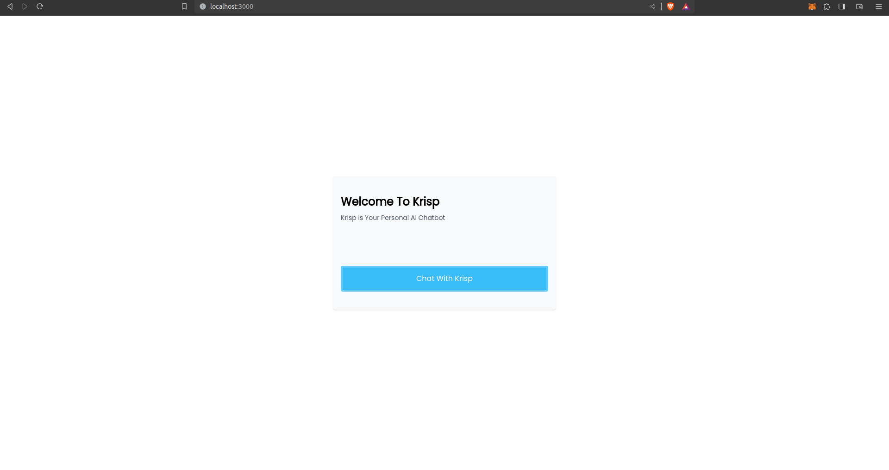
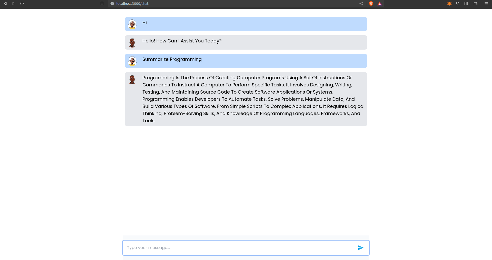

# HNGX Chatbot 🚀

This is a simple chatbot built with **React, Tailwindcss and OpenAI's API**. I built this project to escape the townhall channel. 😅

## What I learned

Though I've worked with React and Tailwindcss before so I decided to try something new, I used **Axios** which was super fun and convenient to use.

## Backend API

I built the backend API using **Express**

## Images

**Home Page**

**Chat Page**

[Backend API](https://github.com/Adedoyin-Emmanuel/hngx-chatbot-task-api)
